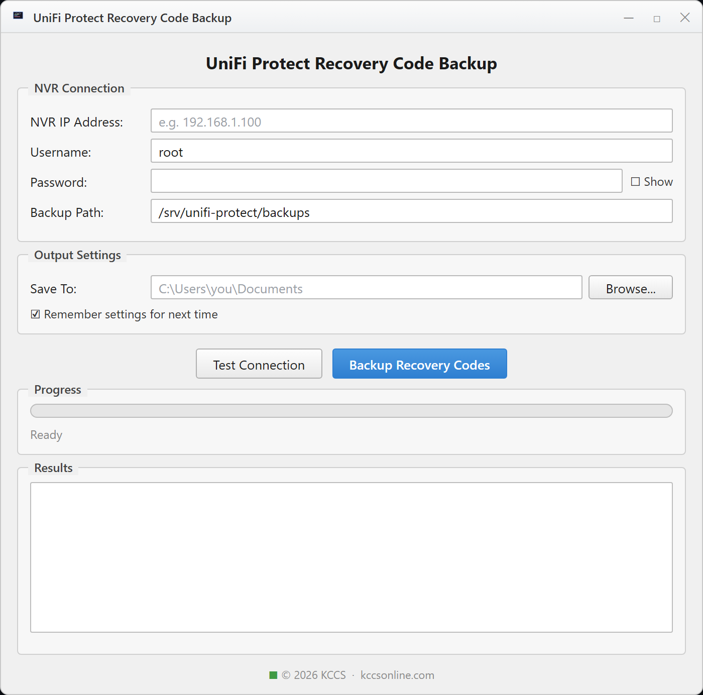
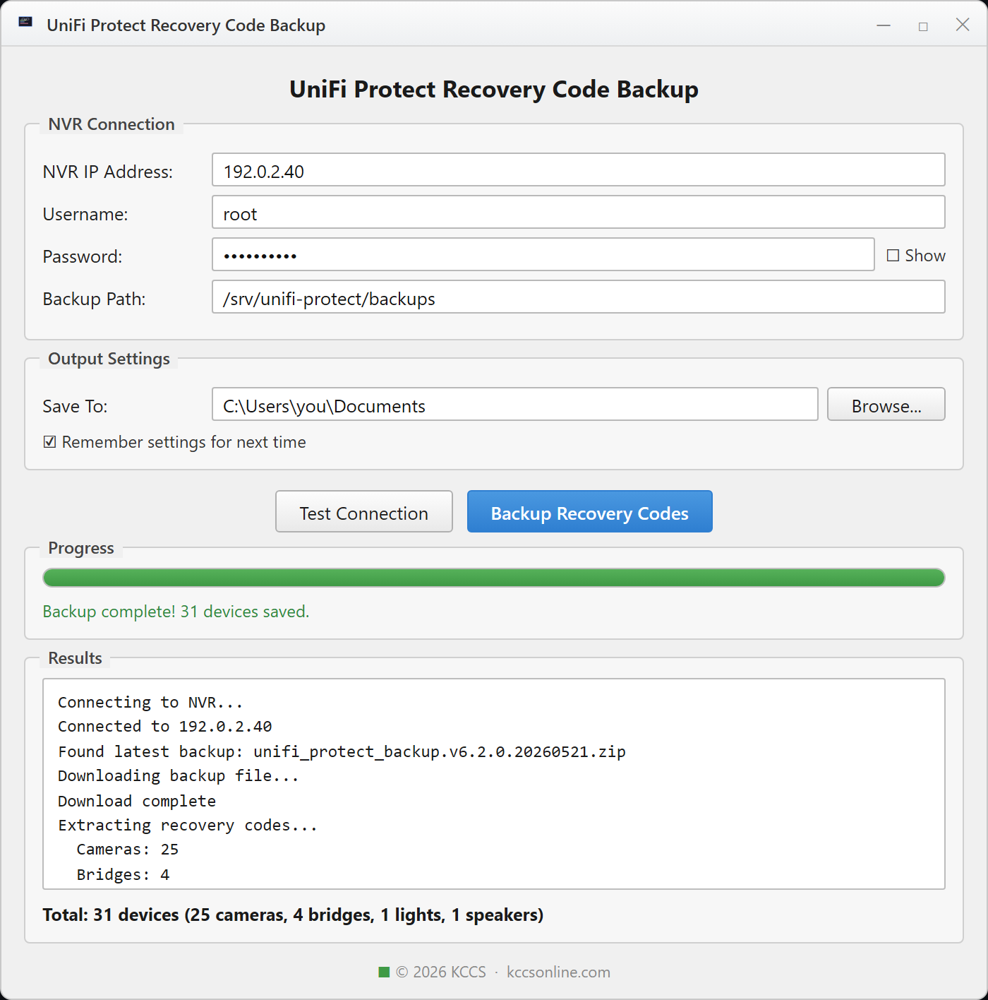

<div align="center">


```
╔═══════════════════════════════════════════════════════════════════╗
║                                                                     ║
║   ██╗   ██╗███╗   ██╗██╗███████╗██╗    ██████╗ ███████╗ ██████╗    ║
║   ██║   ██║████╗  ██║██║██╔════╝██║    ██╔══██╗██╔════╝██╔════╝    ║
║   ██║   ██║██╔██╗ ██║██║█████╗  ██║    ██████╔╝█████╗  ██║         ║
║   ██║   ██║██║╚██╗██║██║██╔══╝  ██║    ██╔══██╗██╔══╝  ██║         ║
║   ╚██████╔╝██║ ╚████║██║██║     ██║    ██║  ██║███████╗╚██████╗    ║
║    ╚═════╝ ╚═╝  ╚═══╝╚═╝╚═╝     ╚═╝    ╚═╝  ╚═╝╚══════╝ ╚═════╝    ║
║                                                                     ║
║      U n i F i   P r o t e c t   R e c o v e r y   C o d e s        ║
║                  ·  back them up before you need them  ·            ║
╚═══════════════════════════════════════════════════════════════════╝
```

**Point-and-click backup of UniFi Protect device recovery codes — from _any_ NVR.**


</div>

---

## Why you want this

Every UniFi Protect device — cameras, bridges, lights, speakers, AI Ports,
sirens, and viewers — has a **recovery code** —
a per-device password buried inside your NVR's nightly backup. You almost never
think about it... until the day a device won't re-adopt after a factory reset, or
you're migrating to a new controller, and UniFi asks for a code you've never seen.

> **No code, no adoption.** A camera that won't take its recovery code can end up a brick.

This tool connects to your NVR over SSH, grabs the latest backup, and extracts
**every device's recovery code** into a clean CSV you can stash somewhere safe.
No hardcoded IPs, no cloud, nothing leaves your machine.

```
        ┌──────────┐   SSH    ┌──────────────┐  extract  ┌──────────────┐
        │   You    │ ───────► │  UniFi NVR   │ ────────► │ recovery.csv │
        │ (GUI/CLI)│ ◄─────── │ latest .zip  │   codes   │  (local)     │
        └──────────┘ download └──────────────┘           └──────────────┘
```

---

## Screenshots

| Ready to connect | Backup complete |
|:---:|:---:|
|  |  |

---

## Quick Start

### 🪟 Windows — just double-click

| Launcher | Needs | Notes |
|----------|-------|-------|
| **`RUN_BACKUP.bat`** | Nothing but Windows | Runs the standalone **PowerShell** GUI. Uses PuTTY (`pscp`/`plink`) if present. |
| **`RUN_BACKUP_GUI.bat`** | Python | Runs the **Python/Tkinter** GUI. Auto-installs `paramiko` for you. |

1. Double-click a launcher above.
2. Enter your NVR **IP**, **username** (usually `root`), and **password**.
3. Click **Test Connection** → then **Backup Recovery Codes**.
4. A timestamped CSV lands in your **Documents** folder. Done.

### 🐍 Run the Python GUI directly

```bash
pip install paramiko
python unifi_protect_backup_gui.py
```

### 💻 Command line (run on the NVR)

```bash
python3 extract_recovery_codes.py                          # all codes, text
python3 extract_recovery_codes.py /path/to/backup.zip csv  # export to CSV
python3 extract_recovery_codes.py /path/to/backup.zip json # export to JSON
```

---

## Requirements

| Path | Needs |
|------|-------|
| PowerShell GUI (`RUN_BACKUP.bat`) | Windows 10/11 (PowerShell 5.1+). [PuTTY](https://www.putty.org/) for SSH transfer. |
| Python GUI / CLI | [Python 3.6+](https://www.python.org/downloads/) and `paramiko` (`pip install paramiko`). |

---

## How it works

```
 1. UniFi Protect writes an automatic backup .zip nightly (~00:00)
 2. This tool SSHes in and finds the most recent backup
        ↳ probes /srv/unifi-protect/backups, /etc/unifi-protect/backups,
          /data/unifi-core/backups, /data/unifi-protect/backups
 3. Downloads it to a temp file
 4. Reads cameras / bridges / lights / speakers / aiports / sirens / viewers .json
        ↳ each device's recovery code lives in its "password" field
 5. Writes recovery_codes_<timestamp>.csv  ──►  your Save-To folder
 6. Deletes the temp backup. Nothing is uploaded anywhere.
```

---

## CSV output

```csv
Type,Name,Model,MAC,IP,Recovery Code
Camera,Front Door,UVC G4 Bullet,02005E100001,192.0.2.11,EXAMPLE_CODE_aaaaaaaa
Camera,Driveway,UVC G6 Bullet,02005E100002,192.0.2.12,EXAMPLE_CODE_bbbbbbbb
Bridge,Garage,UFP-UAP-B,02005E100003,192.0.2.13,EXAMPLE_CODE_cccccccc
```

> _Example rows use RFC 5737 test IPs and placeholder codes. Your real CSV will
> contain live secrets — see the warning below._

---

## ⚠️ Security — read this

```
 ┌─────────────────────────────────────────────────────────────────┐
 │  A recovery code grants full authority to ADOPT that device.    │
 │  The exported CSV is, effectively, a password file.             │
 └─────────────────────────────────────────────────────────────────┘
```

- **Never commit a real CSV to git.** This repo's `.gitignore` already blocks
  `*.csv` and `config.json` — keep it that way.
- Store the CSV in encrypted/secure storage; keep an offline copy for DR.
- The GUIs **never save your password** — only the IP, username, and paths.
- Don't reuse important passwords as device codes, and don't share codes publicly.

---

## Using a recovery code

1. Factory-reset the device (hold reset ~10s).
2. It appears as **Adoptable** in UniFi Protect.
3. When prompted during adoption, enter the recovery code for that device's MAC.
4. It adopts. (Codes are case-sensitive — watch for typos.)

---

## What's in the box

| File | What it is |
|------|------------|
| `unifi_protect_backup_gui.py` | Python/Tkinter GUI (cross-platform) |
| `UniFi-Protect-Backup.ps1` | Standalone PowerShell GUI (no Python needed) |
| `extract_recovery_codes.py` | CLI extractor (text / JSON / CSV) |
| `backup_recovery_codes.sh` | Server-side automation + retention |
| `download_latest.ps1` | Pull the latest CSV from the NVR to Windows |
| `RUN_BACKUP.bat` / `RUN_BACKUP_GUI.bat` / `UPDATE_BACKUP.bat` | Double-click launchers |
| `SERVER_README.md` | Server-side (on-the-NVR) guide |
| `QUICK_REFERENCE.txt` | One-page cheat sheet |

---

## Troubleshooting

| Symptom | Fix |
|---------|-----|
| `paramiko not found` | `pip install paramiko` (or use `RUN_BACKUP_GUI.bat`). |
| PuTTY tools not found | Install [PuTTY](https://www.putty.org/) and add it to PATH (PowerShell GUI). |
| Connection failed | Check IP / credentials, NVR reachability, and that SSH is enabled. |
| No backup files found | Enable automatic backups in UniFi Protect; wait for the nightly run. |
| Recovery code doesn't work | Match the code to the device **MAC**; confirm a clean factory reset. |

---

<div align="center">


**■ © 2026 KCCS · [kccsonline.com](https://kccsonline.com)**

_Built by [KCCS](https://kccsonline.com). Not affiliated with or endorsed by Ubiquiti Inc._
_"UniFi" and "UniFi Protect" are trademarks of Ubiquiti Inc._

</div>
